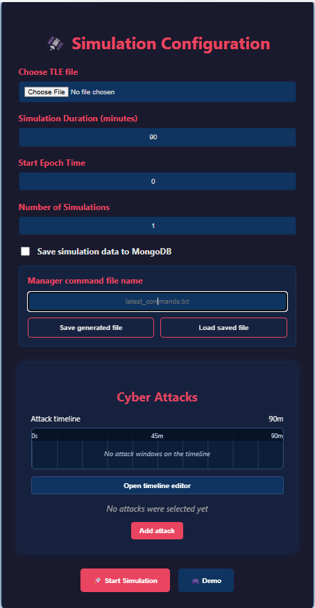
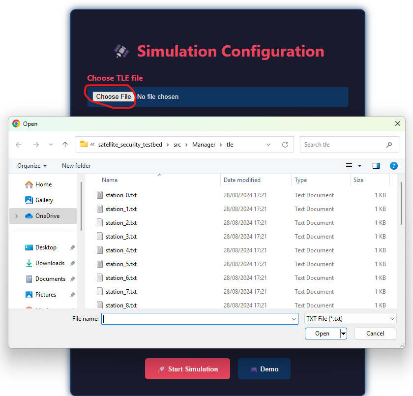
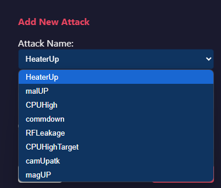
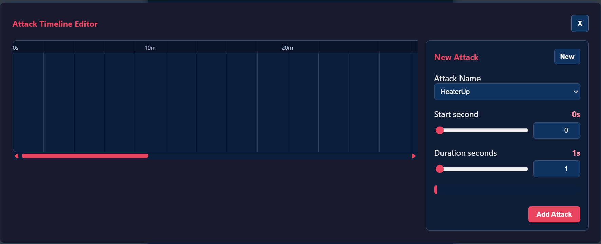
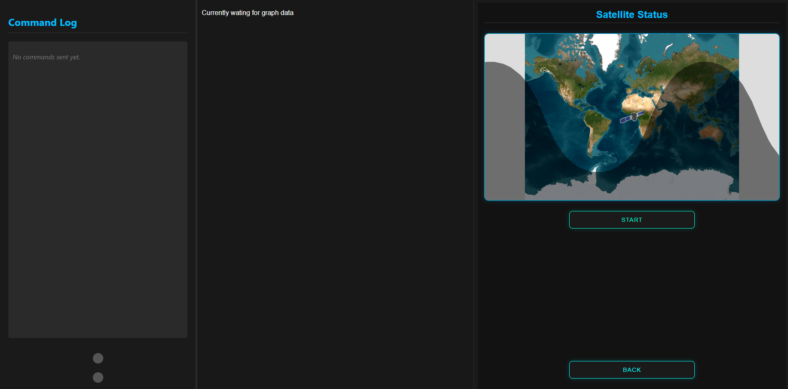
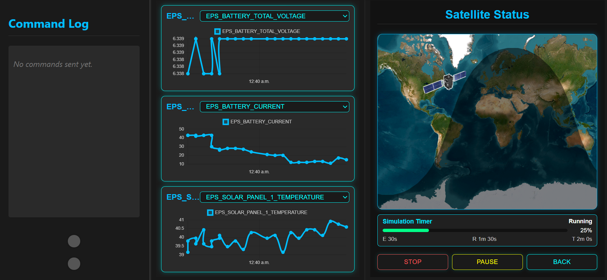

# Satellite Security Testbed GUI Guide

This guide explains how to use the WebApp to configure and run a simulation.

## Open the WebApp

Start the Manager and then the WebApp:

```bash
cd src/Manager
python ManagerServer.py
```

```bash
cd WebApp/TestBedWebApp
npm run dev
```

Open the Vite URL, normally:

```text
http://localhost:5173
```

## Simulation Configuration Screen

The first screen is the simulation configuration form.



Configure:

- **TLE file** - upload a `.txt` file containing the satellite name and two TLE lines.
- **Simulation Duration** - duration in minutes. `90` minutes is a useful default for a full-orbit style run.
- **Start Epoch Time** - filled from the uploaded TLE epoch, but can be edited manually.
- **Number of Simulations** - usually `1` for a manual run.
- **Save simulation data to MongoDB** - turn this on only when the run should be written to MongoDB. When it is off, the Manager still streams live data to the WebApp but skips Mongo writes for the run.
- **Manager command file name** - optional file name used when saving or loading an operational command timeline. If left empty, the Manager uses `latest_commands.txt`.
- **Save generated file** - saves the command file generated by the operational component on the Manager computer.
- **Load saved file** - opens a browser file picker so you can choose a previously saved command file and send it to the operational component for reuse.
- **Cyber Attacks** - optional scheduled attacks.

There is also a **Demo** button that loads demo parameters from `src/config/demoParameters.jsx`.

Saved command files are stored by the Manager in:

```text
src/Manager/saved_command_files/
```

Use **Load saved file** when you want the next run to use the same operational command schedule instead of generating a new one. The selected file is uploaded from the WebApp machine to the Manager and then forwarded to the operational component.

## TLE File Selection

Upload a text file containing the TLE.



The frontend reads the second TLE line and converts its epoch field into Unix epoch seconds for the start time.

## Adding Cyber Attacks

Use the cyber attack panel to choose attacks and schedule when they should run.



Click **Add attack** and fill:

- `Attack Name` - selected from the predefined attack list.
- `Start second` - slider and number box for the attack start time in simulation seconds.
- `Duration seconds` - slider and number box for the attack length in seconds.



Example:

```text
occurrence: 90
duration: 20
```

The current editor creates one attack window at a time. For example, start second `90` and duration `20` schedules the selected attack at second 90 for 20 seconds.

Selected attacks are shown on the attack timeline. Click an attack row or choose **Open timeline editor** to open the larger floating editor. In that window, click an attack block to edit it, drag the block to move its start time, or drag the right edge to extend or shorten its duration.

The attack timeline uses the simulation duration from the configuration screen. If the duration is empty or invalid, the WebApp will not allow new attacks to be added. After at least one attack is scheduled, the simulation duration is locked so the existing attack windows stay aligned with the timeline. Use **Remove all attacks** to clear the schedule and unlock the duration field. The remove-all action requires checking a confirmation box before it runs.

## Starting the Simulation

After the configuration form is submitted, the app navigates to the live simulation page.



Click **Start** in the status panel. The WebApp sends the start message to the Manager, and the Manager starts the component handshake.

After pressing **Start**, the WebApp may briefly show `Starting` while the Manager boots and prepares the orbital, operational, and cyber components. The simulation timer starts only after the Manager confirms that all components are ready.

When the simulation is running:

- the simulation timer shows elapsed time, remaining time, total duration, and percent complete
- the map displays satellite position and day/night information
- telemetry graph data appears when received from the Manager
- commands are added to the command log
- cyber attack effects can be monitored through command/graph changes

When the configured duration ends, the WebApp automatically returns to the configuration screen and shows a closeable **Simulation Ended** popup. After closing the popup, you can adjust settings and start another simulation.

## Live Simulation Screen



Main areas:

- left panel - command log
- center panel - telemetry graphs
- right panel - satellite map and simulation controls

## Controls

- **Start** - begins the simulation and sends configuration to the Manager.
- **Stop** - stops the simulation and resets frontend graph state.
- **Pause** - pauses Manager execution.
- **Resume** - resumes after pause.
- **Back** - returns to the configuration screen. If a simulation is running, the WebApp sends a stop message first.

Pause is best kept for development/testing. For hardware-connected runs, stopping and restarting is usually safer than leaving hardware outputs paused unexpectedly.

## Tips

- Start the component daemons before pressing **Start**.
- Use a 90-minute duration when you want realistic orbital coverage.
- Keep attack occurrence and duration windows inside the simulation duration.
- Check that the TLE file has exactly the expected name/line1/line2 structure.
- If nothing updates after pressing **Start**, verify that the Manager WebSocket is reachable at `ws://127.0.0.1:8765`.
